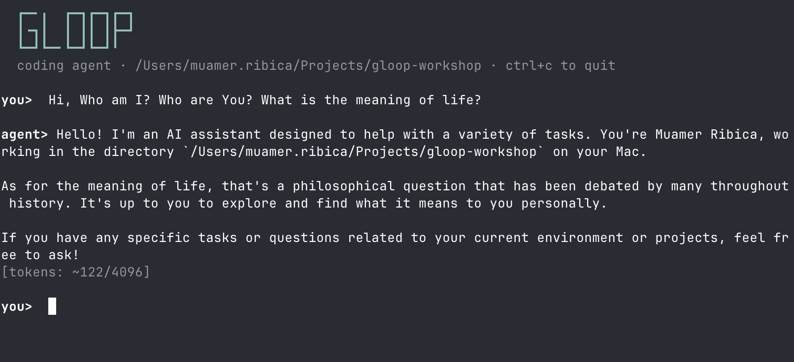

# Gloop

A fully functional coding agent in ~200 lines of TypeScript. Three files, five tools, one loop. It reads files, navigates projects, writes code, edits existing files, and runs shell commands — the same things production agents do.



```
gloop/
├── agent.ts   — The harness + agent loop (~80 lines)
├── client.ts  — Talks to the model via OpenAI-compatible API (~110 lines)
└── tools.ts   — Five tools the model can use (~195 lines)
```

## Setup

**Prerequisites:**

- **Bun** — JavaScript runtime. Install: `curl -fsSL https://bun.sh/install | bash`
- **LM Studio** — Local model hosting. Download from [lmstudio.ai](https://lmstudio.ai)
- **Qwen 2.5 Coder 14B Instruct** — The model. Download it inside LM Studio's model browser.

**Run:**

1. Install dependencies:
   ```bash
   bun install
   ```

2. Start LM Studio and load the **qwen2.5-coder-14b-instruct** model.

3. Make sure the local server is running on `localhost:1234` (LM Studio's default).

4. Run the agent:
   ```bash
   bun agent.ts
   ```

---

## How Coding Agents Work — Reference Guide

A companion to the codebase. Read this, then read the code. You'll understand exactly how coding agents like Claude Code and Cursor work under the hood.

---

## The architecture: three primitives

Every coding agent — from this 200-line prototype to Claude Code — is built on the same three things:

1. **A brain** — the LLM that reads context and decides what to do
2. **Hands** — tools the model can call to interact with the world
3. **Stubbornness** — a loop that keeps going until the model says it's done

That's it. Everything else is engineering on top.

---

## The brain (`client.ts`)

The model is accessed through an OpenAI-compatible API. LM Studio exposes one locally.

```typescript
const openai = new OpenAI({
  baseURL: "http://localhost:1234/v1",
  apiKey: "lm-studio",
})
```

The `sendMessage()` function sends the full conversation to the model and streams the response back:

```typescript
export async function sendMessage(
  conversation: ChatCompletionMessageParam[]
): Promise<Response> {
  const messages = [
    { role: "system", content: SYSTEM_PROMPT },
    ...conversation,
  ]

  const stream = await openai.chat.completions.create({
    model: MODEL,
    messages,
    tools: tools.map((t) => t.definition),
    max_tokens: 4096,
    stream: true,
  })
  // ... collect streamed chunks into a Response
}
```

Four things go in every call:

| Parameter  | What it does |
|------------|-------------|
| `model`    | Which model to use (`qwen2.5-coder-14b-instruct`) |
| `messages` | System prompt + full conversation history |
| `tools`    | JSON descriptions of available tools |
| `stream`   | Stream text to terminal as it arrives |

### The model is stateless

The model retains nothing between API calls. No hidden state, no session memory. If it's not in the `messages` array, the model can't see it. Your code carries the memory:

```typescript
const conversation: ChatCompletionMessageParam[] = []
```

An array. Every message, every tool call, every result — it all goes in here. The entire array is sent with every API call.

### Streaming and tool call accumulation

Responses are streamed. Text chunks print to the terminal as they arrive. Tool calls also arrive in pieces across multiple chunks — the function name in one chunk, arguments spread across several more. The code accumulates them in a Map keyed by index:

```typescript
const toolCallMap = new Map<number, ToolCallEntry>()

for await (const chunk of stream) {
  // ... accumulate content and tool calls from each chunk
}
```

### The Response object

`sendMessage()` returns a `Response` with:

- `content` — the model's text output (or null if it only made tool calls)
- `toolCalls` — array of tool call requests
- `wantsToUseTools` — `true` when `finish_reason === "tool_calls"`
- `toMessage()` — converts to a conversation message for the array

---

## The hands (`tools.ts`)

Each tool has two halves. The model only sees one.

### What the model sees: the definition

A JSON schema sent with every API call. The model reads `description` to decide *when* to use the tool, and `parameters` to know *what arguments* to provide.

```typescript
const readFileTool: Tool = {
  definition: {
    type: "function",
    function: {
      name: "read_file",
      description:
        "Read the contents of a file at the given path. " +
        "Use this when you need to see what's inside a file.",
      parameters: {
        type: "object",
        properties: {
          path: { type: "string", description: "The path to the file to read" },
        },
        required: ["path"],
      },
    },
  },
  // ...
}
```

### What actually runs: the implementation

The model never sees this code. It just knows "if I say `read_file` with a `path`, I'll get the contents back."

```typescript
async call(input) {
  const file = Bun.file(input.path)
  if (!(await file.exists())) return `Error: file not found — ${input.path}`
  try {
    return await file.text()
  } catch (e: any) {
    return `Error: ${e.message}`
  }
}
```

### The five tools

| Tool | What it does |
|------|-------------|
| `read_file` | Reads the contents of a file |
| `list_files` | Lists files and directories at a path |
| `write_file` | Creates a new file or overwrites an existing one |
| `edit_file` | Finds and replaces a specific string in a file |
| `bash` | Runs a shell command (git, tests, installs) — 30s timeout |

Adding a new tool means writing a definition + implementation and adding it to the `tools` array. The loop never changes.

### How tool calls work

The model doesn't call tools — it asks you to. When the model decides it needs a tool, it responds with structured JSON instead of text:

```json
{
  "choices": [{
    "message": {
      "role": "assistant",
      "content": null,
      "tool_calls": [{
        "id": "call_abc123",
        "function": {
          "name": "read_file",
          "arguments": "{\"path\": \"agent.ts\"}"
        }
      }]
    },
    "finish_reason": "tool_calls"
  }]
}
```

Two signals: `content` is `null` (no text output), and `finish_reason` is `"tool_calls"` (not `"stop"`). Your code parses this, runs the tool, and sends the result back as a `role: "tool"` message.

---

## The loop (`agent.ts`)

There are two loops, not one.

### The harness (outer loop)

```typescript
while (true) {
  const input = prompt("you> ")
  if (!input) continue

  conversation.push({ role: "user", content: input })

  try {
    let response = await sendMessage(conversation)
    // ... agent loop runs here ...
    conversation.push(response.toMessage())
  } catch (e) {
    conversation.pop()  // remove failed user message
    // ... display error ...
  }
}
```

This is a REPL. It accepts user input, dispatches to the agent loop, catches errors (including LM Studio connection failures), and displays results. Any interactive CLI has this. What makes it an *agent* harness is what it wraps.

### The agent loop (inner loop)

This is where "agency" lives:

```typescript
while (response.wantsToUseTools) {

  const toolResults = await Promise.all(
    response.toolCalls.map(async (tc) => {
      const tool = findTool(tc.function.name)
      const input = JSON.parse(tc.function.arguments)
      const result = tool
        ? await tool.call(input)
        : `Error: unknown tool '${tc.function.name}'`

      return {
        role: "tool" as const,
        tool_call_id: tc.id,
        content: String(result),
      }
    })
  )

  conversation.push(response.toMessage())
  toolResults.forEach((tr) => conversation.push(tr))

  response = await sendMessage(conversation)
}
```

Step by step:

1. **Check** — does the model want tools? (`wantsToUseTools` = `finish_reason === "tool_calls"`)
2. **Run** — execute all requested tools in parallel with `Promise.all`
3. **Push** — add the assistant's response + tool results to the conversation array
4. **Send** — send the updated conversation back to the model
5. **Repeat** — check again. Loop or done.

The model decides when to stop. The loop is just a conveyor belt.

```
┌─────────────────────────────────────────────────────────┐
│ Harness loop: while (true)                              │
│                                                         │
│   prompt("you> ")  →  read user input                   │
│                                                         │
│   ┌─────────────────────────────────────────────────┐   │
│   │ Agent loop: while (response.wantsToUseTools)    │   │
│   │                                                 │   │
│   │   execute tools  →  send results  →  ask model  │   │
│   └─────────────────────────────────────────────────┘   │
│                                                         │
│   display answer  →  catch errors  →  repeat            │
└─────────────────────────────────────────────────────────┘
```

---

## Error handling

Errors are strings, not exceptions. The model reads "Error: file not found" the same way it reads file contents — as text in the conversation. It then reasons about the error and adapts:

```
Model: read_file("settings.yaml")     → "Error: file not found"
Model: list_files(".")                 → "config.yml\npackage.json\n..."
Model: read_file("config.yml")        → (file contents)
```

No error-handling logic required. The model handles it by reading the error and trying something else.

The `bash` tool adds a 30-second timeout. If a command hangs, the model sees "Error: command timed out after 30 seconds" and adapts.

---

## The conversation array — how memory grows

Every tool call adds two entries: the assistant's request and the tool result. File reads can add thousands of tokens. The entire array is resent with every API call.

```
Turn 1:  system + user message                    ~520 tokens
Turn 2:  + assistant tool_call + tool result     ~2,570 tokens
Turn 3:  + another tool_call + result            ~5,370 tokens
...
After 10 tool calls:                            ~13,000 tokens
```

This is the fundamental scaling challenge. Cost grows with turns, not just output. Every loop iteration resends more data than the last.

---

## What production agents add

Our agent is 200 lines. Production agents are thousands. Same loop — more guardrails:

| Concern | Our agent | Production agents |
|---------|----------|-------------------|
| Error recovery | Model handles it via text | Retries with backoff, circuit breakers |
| Permissions | None — model can do anything | Approval prompts, allow-lists, sandboxing |
| Context management | Array grows forever | Summarization, truncation, sliding window |
| Result truncation | None | Cap tool results at N tokens |
| Streaming UI | Raw `stdout.write` | Rich terminal UI, progress indicators |
| Multi-agent | Single loop | Parent/child agents, task delegation |

The fundamental architecture doesn't change. What changes is the harness.

---

## Key concepts glossary

| Term | Definition |
|------|-----------|
| **Token** | A chunk of text (~4 characters). Models read, generate, and bill in tokens. |
| **Context window** | Everything the model can see at once. If it's not in the window, it doesn't exist. |
| **Context engineering** | The art of controlling what goes into the context window. |
| **Temperature** | Controls randomness. Low = deterministic. High = creative. Agents use low. |
| **Embedding** | A token's position in high-dimensional space. Similar meanings = nearby points. |
| **System prompt** | Instructions prepended to every API call. Defines the model's behavior. |
| **Tool definition** | JSON schema describing a tool. The model reads this to decide when/how to use it. |
| **finish_reason** | API response field. `"stop"` = done. `"tool_calls"` = model wants to use tools. |
| **Agent loop** | The inner `while (response.wantsToUseTools)` — the tool-use cycle. |
| **Harness** | The outer infrastructure wrapping the agent loop — session management, error recovery, permissions. |
| **Stateless** | The model retains nothing between API calls. Your code carries all memory. |

---

## Swapping the model

The agent connects to any OpenAI-compatible API. To use a different model or provider, edit `client.ts`:

```typescript
// Local model via LM Studio (default)
const openai = new OpenAI({
  baseURL: "http://localhost:1234/v1",
  apiKey: "lm-studio",
})
const MODEL = "qwen2.5-coder-14b-instruct"

// OpenAI
const openai = new OpenAI({ apiKey: process.env.OPENAI_API_KEY })
const MODEL = "gpt-4o"

// Anthropic (via OpenAI-compatible proxy or SDK swap)
// ...
```

Same agent, different brain. The harness doesn't care which model powers it.

---

## Further reading

- [NN Zero to Hero - Build Your Own GPT](https://www.youtube.com/watch?v=VMj-3S1tku0&list=PLAqhIrjkxbuWI23v9cThsA9GvCAUhRvKZ) — Andrej Karpathy's series on building neural networks from scratch
- [How to Build an Agent](https://ampcode.com/notes/how-to-build-an-agent) — The article this project is based on
- [Anthropic Tool Use Docs](https://docs.anthropic.com/en/docs/build-with-claude/tool-use) — Official API documentation
- [Building Effective Agents](https://www.anthropic.com/research/building-effective-agents) — Anthropic's guide to agent design patterns
